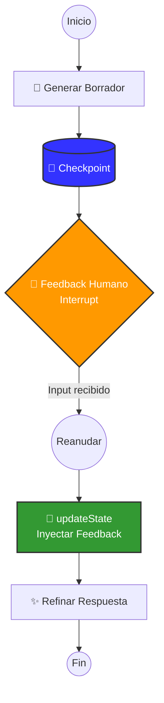
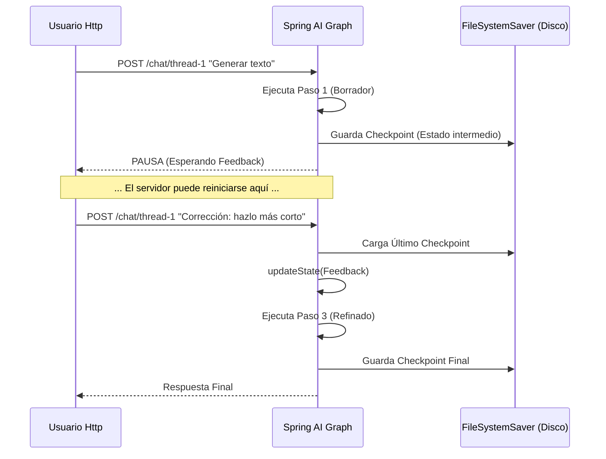

# Spring AI Project - Demo

Este proyecto es una demostración de una aplicación construida con **Spring Boot 4** y **Spring AI 2.0**, utilizando las últimas versiones disponibles a Enero de 2026.

## 🚀 Versiones Utilizadas

Este proyecto utiliza el stack tecnológico más reciente del ecosistema Spring:

*   **Java:** 21 (LTS)
*   **Spring Boot:** 4.0.1
*   **Spring AI:** 2.0.0-M1 (Milestone 1)

> **Nota:** Al utilizar una versión `Milestone` (M1), es necesario configurar repositorios adicionales de Spring (`spring-milestones`) en el `pom.xml`, ya que estas versiones no están en Maven Central estándar.

## 🛠️ Cómo crear este proyecto

Para recrear este proyecto desde cero, sigue estos pasos:

1.  **Generar el proyecto base:**
    Puedes usar [Spring Initializr](https://start.spring.io/) o `curl`. Dado que Spring Boot 4 es muy reciente, generamos un proyecto web básico primero:
    ```bash
    curl -G https://start.spring.io/starter.zip \
        -d dependencies=web \
        -d type=maven-project \
        -d javaVersion=21 \
        -d bootVersion=3.4.1 \
        -o project.zip
    unzip project.zip
    ```
    *(Nota: Si Spring Boot 4 no se puede seleccionar directamente, edita el `pom.xml` tras generar).*

2.  **Configurar `pom.xml`:**
    
    *   **Actualizar versión padre:** Cambiar `spring-boot-starter-parent` a `4.0.1`.
    *   **Añadir Repositorio Milestone:**
        ```xml
        <repositories>
            <repository>
                <id>spring-milestones</id>
                <name>Spring Milestones</name>
                <url>https://repo.spring.io/milestone</url>
                <snapshots>
                    <enabled>false</enabled>
                </snapshots>
            </repository>
        </repositories>
        ```
    *   **Configurar BOM (Bill of Materials) de Spring AI:**
        ```xml
        <dependencyManagement>
            <dependencies>
                <dependency>
                    <groupId>org.springframework.ai</groupId>
                    <artifactId>spring-ai-bom</artifactId>
                    <version>2.0.0-M1</version>
                    <type>pom</type>
                    <scope>import</scope>
                </dependency>
            </dependencies>
        </dependencyManagement>
        ```
    *   **Añadir Dependencias:**
        ```xml
        <dependency>
            <groupId>org.springframework.ai</groupId>
            <artifactId>spring-ai-starter-model-openai</artifactId>
        </dependency>
        ```

## 🌟 Capacidades de Spring AI (Actualizado 2026)

Spring AI ofrece una API portable y unificada para interactuar con diversos modelos de IA. Las capacidades actuales incluyen:

### 1. Modelos de IA (Model Client API)
*   **Chat Models:** Interfaz unificada para OpenAI, Azure OpenAI, Amazon Bedrock, Google Vertex AI, Ollama, Anthropic Claude, etc.
*   **Image Generation:** Generación de imágenes (DALL-E, Stability AI).
*   **Audio:** Transcripción (Speech-to-Text) y Texto a Voz (Text-to-Speech) usando modelos como Whisper.
*   **Embeddings:** Conversión de texto a vectores para búsqueda semántica.

### 2. RAG (Retrieval Augmented Generation)
*   **Vector Stores:** Abstracción para bases de datos vectoriales. Actualmente soporta:
    *   PGVector (PostgreSQL)
    *   Redis
    *   Neo4j
    *   MongoDB Atlas
    *   Chroma, Weaviate, Milvus, Qdrant, etc.
*   **Document Readers:** Utilidades para leer PDFs, JSON, Texto, Markdown.
*   **Document Transformers:** División de documentos (TokenTextSplitter) para indexación.

### 3. Herramientas Avanzadas
*   **Function Calling:** Permite a los modelos de IA invocar funciones Java propias (ej. consultar tu base de datos o API externa) de forma transparente.
*   **Chat Memory:** Gestión del historial de conversación para mantener el contexto.
*   **Evaluation:** Framework para evaluar la calidad de las respuestas de la IA.

## ⚙️ Configuración

Para ejecutar este proyecto, necesitas configurar tu API Key (en este caso para OpenAI) en `src/main/resources/application.properties`:

```properties
spring.ai.openai.api-key=${OPENAI_API_KEY}
```

## 🧠 Arquitectura Agéntica Implementada: Human-in-the-Loop

Este repositorio implementa un patrón avanzado de orquestación de IA conocido como **Human-in-the-Loop (HITL)** utilizando **Spring AI Alibaba Graph**. Este patrón permite pausar la ejecución de un agente automatizado para requerir aprobación, retroalimentación o input explícito de un humano antes de continuar.

### 🌐 Diagrama del Grafo (Mermaid)

El siguiente diagrama ilustra el flujo de control implementado en `AgentGraph.java`, incluyendo el punto de interrupción y persistencia:



### 🔁 Flujo de Persistencia y Reanudación

La "magia" de este patrón reside en la capacidad de persistir el estado completo de la memoria del agente (Stack Frames, Variables, Mensajes) en disco (o base de datos), permitiendo reiniciar el servidor entre pasos sin perder el contexto.



### 📚 Librerías y Tecnologías Clave

*   **[`spring-ai-alibaba-graph-core`](https://github.com/alibaba/spring-ai-alibaba)**: El motor de grafos agénticos. Es el equivalente funcional a LangGraph en el ecosistema Java. Maneja la orquestación de nodos y aristas.
*   **`spring-ai-core`**: Provee las abstracciones fundamentales como `ChatClient` y el manejo de `UserMessage`/`AssistantMessage`.
*   **`FileSystemSaver`**: Implementación de persistencia que serializa el estado del grafo a JSON y lo guarda en la carpeta local `./checkpoints` (equivalente a `SqliteSaver` en ejemplos de Python).

### 🆚 Spring AI Alibaba Graph (Java) vs LangGraph (Python)

¿Por qué implementar esto en Java en lugar de usar el popular stack de Python? Aquí las ventajas de esta implementación empresarial:

| Característica | LangGraph (Python) | Spring AI Graph (Java) | Ventaja Java / Spring |
| :--- | :--- | :--- | :--- |
| **Tipado de Datos** | Dinámico (Dicts), propenso a errores en runtime. | **Fuertemente Tipado** (Records, Classes). Compilación segura y refactoring robusto. | ✅ Seguridad y Mantenibilidad |
| **Persistencia** | `SqliteSaver`, `PostgresSaver`. Requiere configuración async compleja. | **Inyección de Dependencias Nativa**. Integración transparente con JPA/Hibernate, Redis o Filesystem. | ✅ Integración Empresarial |
| **Concurrencia** | Limitada por GIL (Global Interpreter Lock). AsyncIO puede ser complejo ("callback hell"). | **Virtual Threads (Java 21)**. Modelo de concurrencia de alto rendimiento, bloqueante pero eficiente. | ✅ Escalamiento |
| **Despliegue** | Requiere gestión de entornos virtuales (venv, conda) y servidores WSGI/ASGI. | **Jar Autocontenido**. Despliegue estándar en cualquier JVM o contenedor, fácil de monitorear (Actuator). | ✅ Operaciones (DevOps) |
| **Modelo de Estado** | Diccionarios mutables. | **OverAllState Inmutable**. Manejo de estado predecible con `StateSnapshot` y `updateState` explícito. | ✅ Robustez |

Esta implementación demuestra que Java es un ciudadano de primera clase para construir agentes de IA complejos, ofreciendo la robustez necesaria para sistemas críticos de negocio.


O exportarla como variable de entorno:

```bash
export SPRING_AI_OPENAI_API_KEY=tu-clave-aqui
```

## 📖 Guía de Aprendizaje y Filosofía del Proyecto

Este proyecto es una plantilla técnica diseñada para **construir sistemas de producción robustos en Java desde el inicio**. Es la opción recomendada cuando la integración empresarial, la escalabilidad y la mantenibilidad a largo plazo son requisitos críticos del caso de uso. A continuación, se resume la hoja de ruta para que desarrolladores se capaciten y comprendan las decisiones de diseño.

### 🏛️ Filosofía: Colaboración entre Ecosistemas

Este proyecto reconoce el valor inmenso de Python en **ciencia de datos y entrenamiento de modelos (Heavy AI)**.

Aunque el ecosistema Java evoluciona rápidamente integrando capacidades avanzadas (como **visión y multimodalidad**), Python sigue siendo una herramienta excelente para exploración, entrenamiento y casos de uso "bleeding edge" donde las herramientas JVM aún puedan estar madurando.

Nuestro objetivo es ofrecer un estándar robusto para la **IA empresarial**, donde Java destaca por su integración con sistemas legacy, concurrencia masiva y tipado fuerte, complementando la agilidad creativa de otros ecosistemas.

| Concepto | Enfoque Dinámico (Python) | Enfoque Empresarial (Java/Este Proyecto) |
| :--- | :--- | :--- |
| **Prompting** | F-strings (Rápido y flexible) | **Templates versionados** (Gobernable y escalable). |
| **Salidas** | Diccionarios dinámicos | **Tipado Fuerte** con `Records` (Seguridad en tiempo de compilación). |
| **RAG** | Ideal para experimentación rápida | **ETL Robusto** con Apache Tika y Bases de Datos Vectoriales gestionadas. |
| **Agentes** | Frameworks de alto nivel (AutoGen) | **Patrones Composables** (Control granular del flujo). |
| **Orquestación** | LangGraph (Potente para grafos) | **Temporal.io / Spring State Machine** (Resiliencia transaccional). |

### 🎓 Ruta de Aprendizaje Recomendada (2026)

Para dominar el stack tecnológico de este proyecto, se recomienda la siguiente progresión de recursos educativos:

1.  **Fundamentos de Spring AI:**
    *   *Curso:* "Spring AI: Beginner to Guru" (John Thompson en Udemy).
    *   *Objetivo:* Asentar bases de `ChatClient`, inyección de dependencias y conexión básica con LLMs.

2.  **Ingeniería de Datos y RAG:**
    *   *Curso:* "Mastering Spring AI: Build AI with Java" (Pritesh Mistry en Udemy).
    *   *Objetivo:* Profundizar en ingestión de documentos, bases de datos vectoriales y transformación de consultas.

3.  **Arquitectura Avanzada e Interoperabilidad:**
    *   *Curso:* "Build AI Apps with Spring AI... MCP, AI Testing" (Madan Reddy en Udemy).
    *   *Objetivo:* Aprender **Model Context Protocol (MCP)** para conectar herramientas y **Testing** automatizado de IA.

4.  **Teoría de Agentes:**
    *   *Curso:* "AI Agents in Java..." (Vanderbilt University en Coursera).
    *   *Objetivo:* Comprender la arquitectura cognitiva de los agentes (Planificación, Memoria) más allá del código.

## 🤖 Asistente de GitHub Copilot

Este repositorio incluye instrucciones especializadas para el agente, ubicadas en [`.github/instructions/springai.instructions.md`](.github/instructions/springai.instructions.md).

Estas pautas aseguran que cualquier código generado por la IA respete la arquitectura de referencia:
*   **Enfoque Java-Nativo:** Preferencia por tipado fuerte (Records, POJOs) y conversión estructurada (`BeanOutputConverter`) frente a JSON crudo.
*   **Arquitectura Spring AI:** Uso de `ChatClient` fluente, `Advisors` recursivos y abstracciones oficiales en lugar de ports directos de librerías de Python.
*   **Calidad de Ingeniería:** Integración obligatoria de *Testcontainers* y *Evaluators* para pruebas robustas.

## 📚 Documentación Oficial

Para más detalles, consulta la documentación oficial, que se actualiza constantemente con nuevas integraciones:

*   [Documentación de Referencia de Spring AI](https://docs.spring.io/spring-ai/reference/)
*   [Repositorio de GitHub (Spring AI)](https://github.com/spring-projects/spring-ai)
*   [Repositorio de GitHub (Spring AI Alibaba Graph)](https://github.com/alibaba/spring-ai-alibaba)

